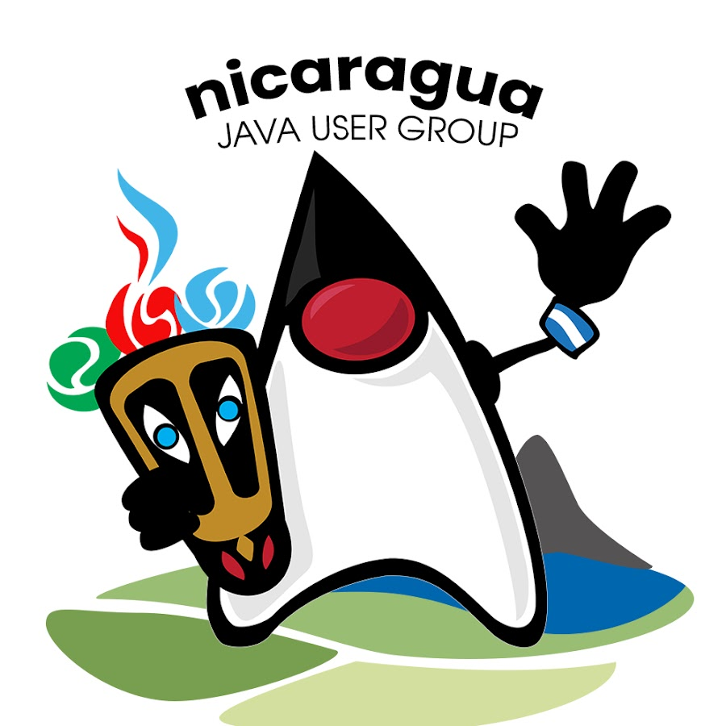

## Qué hacemos

Somos el JUG (Java User Group) Nicaragua, una comunidad de personas interesadas en Java, la JVM y el desarrollo de software.

Organizamos meetups, charlas y talleres para aprender, compartir experiencias y conectar con otras personas del ecosistema tech.

También compartimos recursos, armamos proyectos open source y mantenemos espacios donde la comunidad puede preguntar, proponer temas, colaborar y enterarse de próximos eventos.

## Dónde encontrarnos

<table>
  <tr>
    <td align="center">
      
    </td>
    <td align="center">
      
    </td>
    <td align="center">
      
    </td>
    <td align="center">
      
    </td>
    <td align="center">
      
    </td>
    <td align="center">
      
    </td>
  </tr>
</table>

- **Telegram:** nuestro chat principal. Ahí hablamos, preguntamos, compartimos recursos y organizamos eventos.
- **Meetup:** publicamos nuestros eventos ahí. También puedes ver lo que hemos hecho desde 2019.
- **Facebook:** publicamos eventos, fotos, memes y anuncios para la comunidad local.
- **Website:** nuestra página oficial.
- **LinkedIn:** eventos, publicaciones y updates de la comunidad.
- **YouTube:** grabaciones de charlas, talleres y eventos.

## Repositorios

En esta organización vas a encontrar demos, ejemplos, herramientas y proyectos creados por miembros de la comunidad.

Trabajamos temas como:

- Desarrollo Java
- Spring Boot
- Jakarta EE
- Quarkus
- APIs REST
- IA aplicada en Java/JVM
- Maven
- Hibernate
- Herramientas para la comunidad

## Participa

Puedes sumarte asistiendo a eventos, entrando al chat, proponiendo charlas, contribuyendo a proyectos o compartiendo lo que estás aprendiendo.

No hace falta ser experto. Si te interesa Java, eres bienvenido.